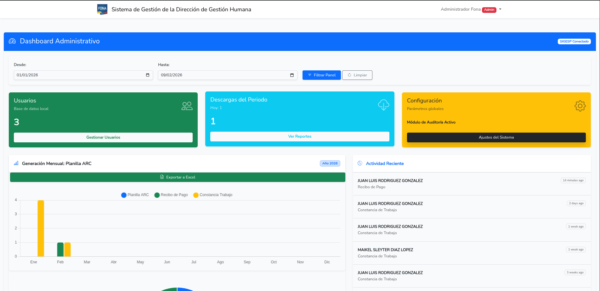
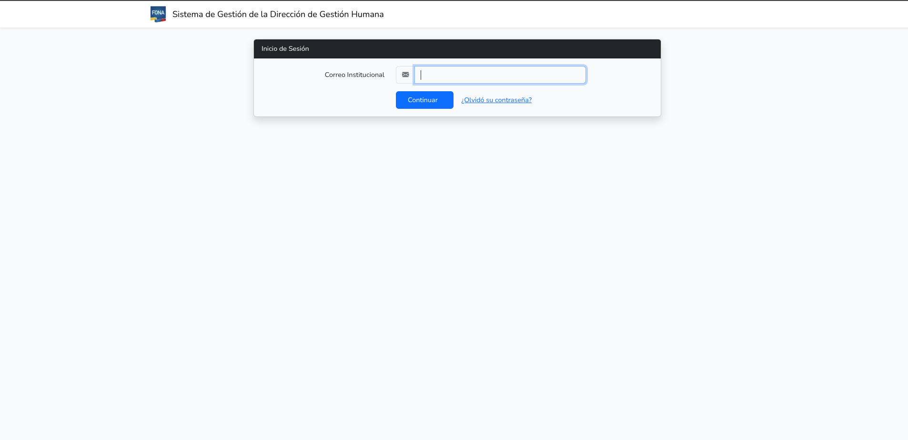
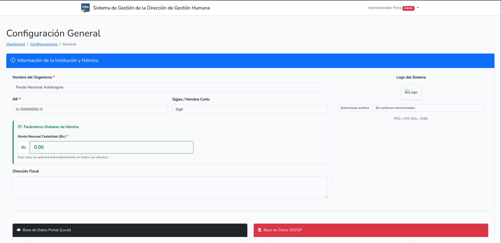
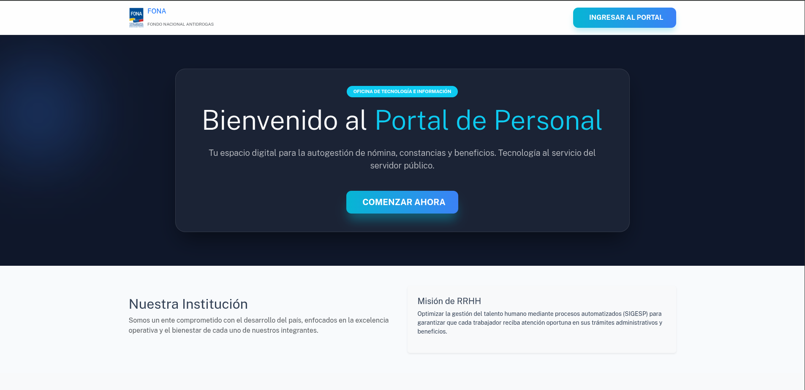
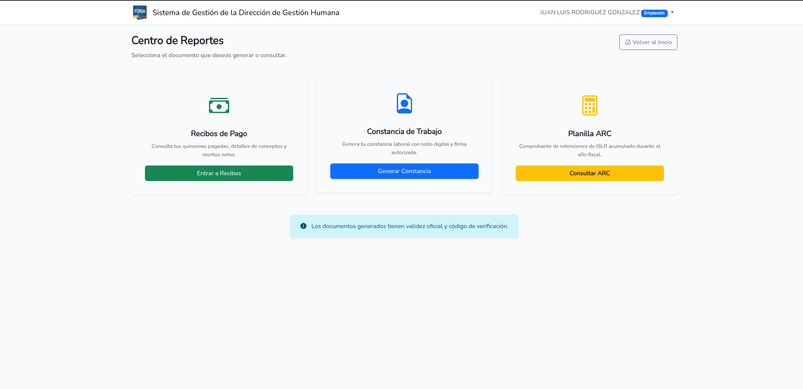

# 🚀 Plataforma de Gestión de Historial (SIGH 2025)

**Sistema Integral de Recursos Humanos diseñado para la optimización de procesos y auditoría de datos.**

---

  <h2>SISTEMA DE GESTIÓN DE NÓMINA REACTIVO</h2>
  
<i>Implementación de Alto Nivel con Laravel 12 & PostgreSQL</i>

  <table style="background-color: #1a1a1a; border-radius: 10px; padding: 20px; border: 1px solid #333;">
    <tr>
      <td align="center"><strong>DESARROLLADOR ÚNICO:</strong></td>
    </tr>
    <tr>
      <td align="center">
         
        <strong>Juan Luis Rodriguez Gonzalez</strong> 
        V-25.523.307 
         
      </td>
    </tr>
  </table>

---

### 📖 Descripción General
El **SIGH 2025** no es solo un gestor de archivos; es un núcleo de auditoría que centraliza la información laboral dispersa. Utiliza una arquitectura orientada a servicios para procesar historiales de nómina, permitiendo la visualización de datos en tiempo real mediante una integración limpia con motores de base de datos relacionales.

---

### 📂 Módulos del Sistema

#### 🛡️ 1. Módulo de Seguridad y Autenticación (RBAC)
* **Control de Acceso:** Implementación de Middleware personalizado para diferenciar entre **Administrador** (Acceso total) y **Analista de RRHH** (Acceso restringido).
* **Protección de Datos:** Encriptación de contraseñas mediante `Bcrypt` y protección contra ataques CSRF y XSS nativa de Laravel 12.
* **Gestión de Sesiones:** Manejo de sesiones persistentes seguras.

#### 📊 2. Módulo de Dashboard Estadístico
* **Vista General:** Panel visual que resume la cantidad de trabajadores activos, recibos generados y alertas de auditoría.
* **Gráficas en Tiempo Real:** Integración de componentes para la visualización de métricas de nómina.

#### 👥 3. Módulo de Gestión de Personal y Roles
* **Vistas de Usuario:** Listado dinámico de empleados con capacidades de filtrado avanzado por cédula, cargo o departamento.
* **Restricciones de Acción:** Lógica de negocio que impide a usuarios de RRHH realizar tareas críticas como el reset de credenciales de otros administradores.

#### 🗄️ 4. Núcleo de Datos (PostgreSQL)
* **Integridad Referencial:** Uso exhaustivo de llaves foráneas y constraints para asegurar que ningún historial quede huérfano.
* **Migraciones Avanzadas:** Estructura de tablas optimizada para consultas de alta velocidad en historiales de larga data.

---

### 🛠️ ¿Cómo funciona el sistema?

1.  **Capa de Acceso:** El usuario ingresa mediante un Login validado. El sistema identifica el rol almacenado en **Postgres** y construye el menú lateral (Sidebar) de forma dinámica.
2.  **Procesamiento:** Laravel 12 actúa como puente, ejecutando Query Builders optimizados para extraer la información del trabajador.
3.  **Interfaz (Frontend):** Se utilizan componentes Blade con estilos adaptativos para asegurar que el personal administrativo pueda trabajar desde cualquier dispositivo.
4.  **Auditoría:** Cada acción queda registrada, permitiendo un seguimiento claro de quién consultó o modificó un historial.

---

### 🌐 Requisitos de Infraestructura
| Servicio | Puerto | Función |
| :--- | :--- | :--- |
| **App Server** | 8000 | Engine Laravel 12 |
| **PostgreSQL** | 5432 | Almacenamiento Persistente |
| **Git/SSH** | 22/443 | Despliegue y Control de Versiones |

### 🖼️ Galería del Sistema (Vistas Principales)

  <table border="0">
    <tr>
      <td width="50%" align="center">
        <strong>💻 Dashboard Principal</strong> 
        
        
<i>Visualización de métricas críticas y acceso rápido.</i>

      </td>
      <td width="50%" align="center">
        <strong>🔑 Control de Acceso</strong> 
        
        
<i>Portal de autenticación segura para usuarios.</i>

      </td>
    </tr>
    <tr>
      <td width="50%" align="center">
        <strong>📋 Gestión de Personal</strong> 
        
        
<i>Módulo de administración de perfiles y roles.</i>

      </td>
      <td width="50%" align="center">
        <strong>🗃️ Vista Incial</strong> 
        
        
<i>Consulta y auditoría de datos integrados con PostgreSQL.</i>

      </td>
      <td width="50%" align="center">
         <strong>📄 Reportes PDF</strong> 
         
         
<i>Documentos legales generados dinámicamente con datos de nómina.</i>

      </td>
    </tr>
  </table>

---

### 🚀 Roadmap & Próximas Mejoras
- [x] **Generación de PDF:** Implementación exitosa para recibos y reportes.
- [ ] **Notificaciones:** Alertas automáticas vía correo electrónico (SMTP).
- [ ] **API Rest:** Endpoint seguro para consulta externa de estatus laboral.
- [ ] **Auditoría de Logs:** Registro detallado de quién descarga cada PDF.

#### 📄 5. Módulo de Reportes y Documentación (PDF)
* **Generación Dinámica:** Motor de renderizado para convertir vistas Blade directamente en documentos PDF profesionales.
* **Recibos de Nómina:** Capacidad de generar recibos individuales con integridad de datos provenientes de PostgreSQL.
* **Constancias de Trabajo:** Automatización de documentos con firma digital simulada y membrete institucional.
* **Descarga Segura:** Implementación de headers de respuesta para asegurar que los documentos se descarguen correctamente en cualquier navegador.
